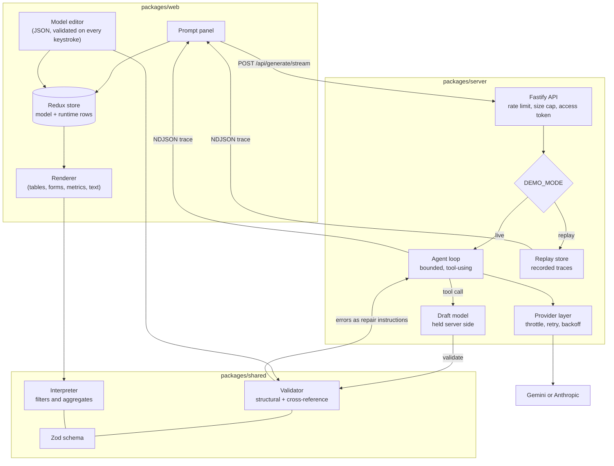

# nl-to-app-model

An agentic system that turns natural-language descriptions into validated, editable application models.

You type "a book tracker with a table of books, a filter by genre, and a count
of unread books". A bounded, tool-using agent builds a JSON document describing
that application: its data model, its components, and the derived values behind
them. The document is validated against a strict schema, and a React client
renders it as a working mini-application. The model stays on screen next to the
rendered result, editable, and the application follows every valid change.

The interesting part is not the demo. It is the pattern: constrain generation to
a schema, validate deterministically, feed the validation errors back as repair
instructions, bound the loop, and measure whether any of it actually helped.

## What is here

| | |
| --- | --- |
| Schema and interpreter | `packages/shared` |
| Provider layer, agent loop, API, eval harness | `packages/server` |
| React and Redux Toolkit client | `packages/web` |
| Eval fixtures and results | `packages/server/src/eval`, `eval/` |

## Running it locally

Requires Node 20.11 or later. Tested on Windows 11 and Linux.

```bash
npm install
npm run build --workspace=@nlam/shared
npm run dev
```

That starts the API on `http://127.0.0.1:8787` and the client on
`http://localhost:5173`. The client works immediately: it ships with four
hand-written reference models, and editing the JSON on the left re-renders the
application on the right.

Generation needs a little more. Copy `.env.example` to `.env` and set a provider
key:

```bash
cp .env.example .env
```

```
LLM_PROVIDER=gemini
GEMINI_API_KEY=your-key
DEMO_MODE=live
```

Without `DEMO_MODE=live` the server runs in replay mode, where it answers from
recorded traces and cannot reach a provider at all. That is the default, and it
is what a public deployment of this would run.

Other useful commands:

```bash
npm test                  # unit tests across all three packages
npm run verify            # charset check, lint, typecheck, tests
npm run eval -- --dry-run # what an eval run would call, without sending anything
npm run eval -- --offline # regenerate the results table from cached outcomes
npm run estimate          # what a paid run would cost, measured not guessed
```

The eval runs one column per provider and mode, and reads and writes a cache
keyed on the case, the model, the prompts and the schema version:

```bash
npm run eval -- --provider anthropic --mode agent,baseline --batch
```

`--batch` sends the baseline fixtures through the batch endpoint at half price.
The agent loop is deliberately excluded: its second turn cannot be written until
the first turn's tool results exist, so batching it would change what is being
measured. Set `LLM_SPEND_CAP_USD` to refuse the next call once a ceiling is in
sight, enforced from the token counts the provider reports rather than from an
estimate made beforehand.

## Architecture



The three packages depend on `shared` and not on each other. The schema, the
validator and the interpreter live there, which is what stops the browser and
the server from developing separate opinions about what a valid model is.

## The application model

A model is a closed JSON document. Every object rejects unknown keys, so a
document that validates contains nothing the renderer cannot interpret.

```json
{
  "schemaVersion": "1.0.0",
  "app": { "name": "Book tracker" },
  "entities": [
    {
      "id": "book",
      "name": "Book",
      "fields": [
        { "id": "title", "label": "Title", "type": "string", "required": true },
        { "id": "genre", "label": "Genre", "type": "enum", "options": ["Fiction", "History"] },
        { "id": "finished", "label": "Finished", "type": "boolean", "required": false }
      ],
      "seed": [{ "title": "Piranesi", "genre": "Fiction", "finished": false }]
    }
  ],
  "components": [
    {
      "id": "unread",
      "type": "metric",
      "title": "Still to read",
      "entityId": "book",
      "aggregate": "count",
      "where": { "combinator": "and", "conditions": [{ "fieldId": "finished", "op": "isFalse" }] }
    },
    {
      "id": "library",
      "type": "table",
      "entityId": "book",
      "filters": [{ "fieldId": "genre", "control": "select" }]
    }
  ],
  "layout": { "type": "grid", "columns": 2 }
}
```

Five field types, four component types, five aggregates and eleven comparison
operators. Derived values are a whitelist of aggregates over a whitelist of
comparisons, evaluated by an interpreter in `packages/shared/src/runtime.ts`.
There is no expression language to parse and no generated code to execute.

Validation runs in two stages. Zod checks the shape. A separate pass checks
everything Zod cannot see: that a table points at an entity that exists, that a
metric sums a field that holds numbers, that a seed row uses one of the enum
options it was given. That second pass produces the most carefully written
messages in the project, because they are what the agent reads when it repairs a
model:

```
components[2].fieldId: The "sum" aggregate needs a field of type "number",
but "title" has type "string". Numeric field ids are "pages", "price".
```

## How generation works

Two modes, both available through the API and both measured.

**Baseline.** One completion, validate, at most one repair pass. This is the
control. It stays in the codebase rather than being deleted after the first
measurement, so the comparison can be rerun whenever the schema or the prompts
change.

**Agent loop.** The model does not write the document at all. It calls tools,
and the server applies them to a draft it owns:

| Tool | What it does |
| --- | --- |
| `plan` | Records the intended entities and components, once, first |
| `create_entity` | Adds or replaces an entity and its fields |
| `set_seed_data` | Gives an entity example rows |
| `add_component` | Adds or replaces a table, form, metric or text block |
| `remove_component` | Removes one |
| `set_layout` | Chooses vertical or grid |
| `validate_model` | Checks the whole draft |
| `finalize` | Accepts it, and refuses while errors remain |

Every call comes back confirmed or rejected with the specific reason, so an
error arrives while the mistake is still local. Per-tool checks go through the
same validator the finished model goes through: the element under test is
dropped into a minimal probe document and only the issues belonging to it are
kept. Reusing the real validator this way means tool feedback and final
acceptance cannot disagree, which a second and looser set of per-tool rules
would eventually allow.

The loop is bounded twice, by iteration count (default 8) and by wall-clock time
(default 90 seconds). Neither bound is allowed to return nothing: whatever the
reason for stopping, the draft is salvaged into the best model that still
validates, and returned alongside a structured report naming what was dropped
and why. A run that ends with one broken metric removed is a better answer than
an error page.

`create_entity` and `add_component` replace an element with the same id rather
than complaining about a duplicate. That gives the model a way to fix its own
mistakes without a separate update tool, and it makes a retry after a rejection
do the obvious thing.

## Prompt injection

The description a caller submits is data, not instruction. It is quoted inside a
delimited block, and the system prompt says plainly that anything inside it
which reads as an instruction describes an application to model and is not to be
followed. Five of the eval fixtures try exactly that, so the claim is measured
rather than asserted.

## Operational posture

- **Structured logging** with a per-request id, provider, model, iteration
  count, latency, token counts and outcome. The prompt itself is never logged,
  only a hash of it, so a log can be kept and shared without carrying user text.
- **Client-side throttling** is the default posture rather than a reaction to
  rejection. Requests are spaced evenly before they are sent, and retries use
  exponential backoff with jitter on transient failures only.
- **Rate limiting and an input size cap** on the public API.
- **A stats endpoint** (`/api/stats`) reporting request counts, success rate,
  latency percentiles and tokens spent today. It says on the endpoint that the
  counters are in memory and reset with the process.
- **Replay mode** is the default. In it the process never constructs a provider
  object at all, so serving an anonymous visitor cannot reach a network: the
  capability is absent rather than merely unused. Live generation is enabled by
  an environment flag and gated by a shared access token.

## Design decisions

**Why a structured model instead of generating code.** Generated code has to be
executed to be seen, which means either sandboxing it or trusting it. A model
has neither problem: it can be validated exactly, rendered by code I wrote,
diffed, edited by hand, and stored. The schema is also what makes the eval
deterministic. The cost is expressiveness, and the schema is deliberately small
enough that the ceiling is obvious rather than surprising.

**Why the model stays visible and editable.** A system that produces a black box
gives you no way to disagree with it in detail. Putting the document on screen,
editable, with validation on every keystroke, turns the output into something
you can correct rather than only regenerate. It is also the cheapest possible
demonstration that the rendered application really is driven by the document.

**Why a tool loop rather than one big completion.** The failure mode of one
completion is a whole document rejected for one bad field, and a repair turn
that has to reproduce everything that was already right. The tool loop moves the
error next to the mistake. Whether that is worth the extra calls is the question
the eval answers, and it is not obvious in advance: the loop costs several times
as many provider calls.

**Why a provider abstraction with two implementations.** An abstraction with one
implementation is a guess. Writing the second one is what proved the interface
carried everything the loop needs: a system prompt, an alternating message list,
tool definitions, tool results and token counts. It also surfaced the two places
where function-calling implementations genuinely disagree, which is why seed
rows and filter expressions are passed as JSON text while every other argument
is structured. The deployed configuration runs on Gemini; the Anthropic adapter
is exercised through an injected fetch in the test suite.

**Why failure returns a partial model.** Eight iterations of work that end in an
error page throw away an application that was mostly right. Salvage drops the
smallest thing that unblocks acceptance, in increasing order of destructiveness,
and the failure report says what it removed.

**Why the eval is judged deterministically.** Validity comes from Zod. The
semantic check is a structural assertion written per fixture, not a language
model grading its own homework. A measurement that inherits the failure modes of
the thing being measured is not a measurement.

**Why there is a cost column when the bill is zero.** These runs happen inside a
free tier, so nothing was billed. That is a fact about the tier, not about the
design, and reporting zero would hide the thing a reader actually wants to know.
The report prices the same token counts at published list rates.

## What running it against a real provider changed

The agent loop was fully tested against a scripted provider before it ever made
a network call: every tool, every rejection path, the iteration cap, the salvage
behaviour. All of it passed. The first live run then failed four times in a row,
for four reasons none of those tests could have found. That gap is the most
useful thing this project taught me, so it is written down rather than quietly
fixed.

**A model id that was current when I wrote it was dead by the time it ran.**
`gemini-2.0-flash` returned a 404 saying it was retired. Its replacement,
`gemini-2.5-flash`, returned a 404 saying it was closed to new projects, which
is a different failure wearing the same status code. The stale id came from this
repository's own `.env.example`, which nothing tested because it is a document,
not code. Config that names an external resource is code that has not been given
a test.

**Provider state has to survive the round trip.** Gemini 3 attaches a thought
signature to the parts it produces and rejects the following turn if it is
missing. The first tool call succeeded; the second call failed with a 400. The
neutral `ToolCall` type needed a field for opaque provider state that nothing
above the adapter reads and every adapter must return verbatim. An abstraction
with one implementation would never have found that, which is the argument for
writing the second adapter in the first place.

**My bounds were guesses wearing the clothes of decisions.** The iteration cap
of 8 was chosen before there was any evidence. The model issued one tool call
per turn and needed ten, so every run hit the cap holding a complete, valid
model it had never been allowed to finalize. And the wall-clock time budget was
counting the rate limiter's own deliberate spacing, which meant tightening the
throttle shortened the budget. It now measures time inside provider calls.

**Quotas are the real constraint, and they are not where you expect.** The
Gemini free tier here is twenty requests per day, per model, per project. Not
per minute. That is discoverable only from the quota block inside a 429 body,
which also names the exact quota id. Meanwhile the same 429 carries a
`RetryInfo` block saying precisely how long to wait, which is strictly better
information than exponential backoff invents. Both are now used, and a rate
limit slows the whole queue rather than only the request that received it.

**A saving that is documented is not the same as a saving that applies.** I
added prompt caching for the static system and tool prefix, expecting it to be
the largest lever, and it did nothing: the API accepted `cache_control` and
silently reported zero cache activity. Measured against Claude Haiku 4.5, a
3,026 token prefix does not cache, nor does 4,313, while 14,694 caches
immediately. This workload's prefix is about 3,000 tokens, so caching is simply
unavailable to it, and nothing in the response says so. The measurement is in
the eval notes because "we enabled caching" would otherwise have read as a
saving that was never there.

## Limitations

- One level of filtering. Conditions are joined by a single combinator and do
  not nest, which covers ordinary filters and nothing more.
- No relationships between entities. Two entities in one model are two flat
  tables, and a description asking for a foreign key gets the honest subset.
- No sorting, pagination, charts, file upload, notifications or export. Each of
  those appears in the eval set precisely because the correct behaviour is to
  model what fits and leave the rest out rather than invent a property.
- Aggregates read one column. "Total value of stock" as price times quantity is
  not expressible.
- Data lives in memory in the browser. Nothing is persisted, and reloading
  starts from the model's seed rows again.
- Metrics are in-process and reset with the server.

## Repository layout

```
packages/
  shared/    schema, validation, interpreter, reference models, prompt reference
  server/    config, provider layer, agent loop, API, replay, eval harness
  web/       React client, Redux store, renderer, model editor
eval/        committed results.json and results.md
scripts/     repository hygiene checks
```
